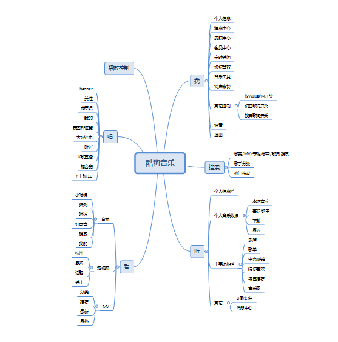
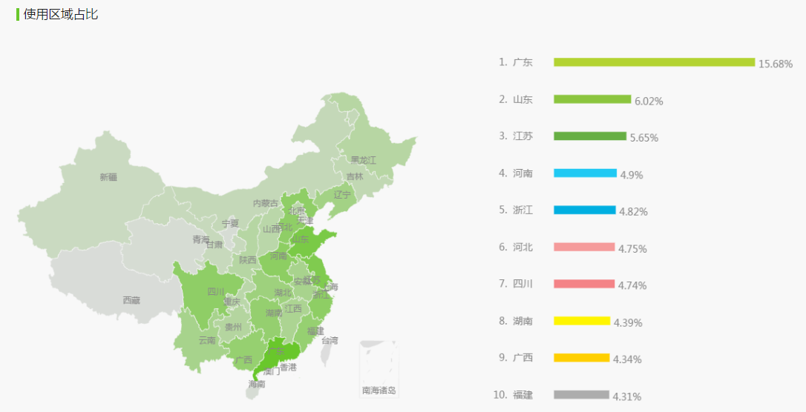
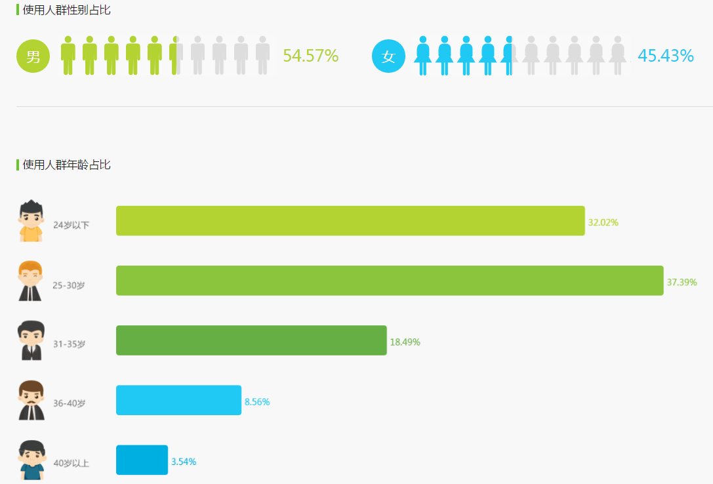

## 一、产品信息
### 1、产品名称：kugou
### 2、体验环境：oppp 
### 3、体验时间：2017-12-12

## 二、产品介绍
### 1、产品简介
        酷狗音乐是中最大的在线音乐播放平台，拥有海量的乐库的在线试听、视频直播、高清MV、K歌、蝰蛇音效、精美写真、听歌识曲等核心功能，强调分享与社交化，集听、看、唱等功能于一体，一站式满足乐迷多样化差异化的娱乐需求
### 2、产品定位
         打造一个涵盖听、看、唱于一体的音乐服务平台。  
### 3、产品结构图

### 4、产品流程图

## 三、用户分析
### 1、用户特征

    

    地域上：酷狗音乐的用户群比较分散，主要分布在广东、山东、江苏等地区；
    年龄上：以25-30岁的人群为主，24岁以下的n年轻人次之；
    性别上：男性比例约为55%，女性比例约为45%；
### 2、目标用户画像
    【学生】
    姓名：小爱
    照片：
    性别：女
    年龄：22
    家庭情况：
    收入：无
    职业：大学生
    喜欢的音乐类型：
    性格：

### 3、用户需求
* 基本需求：收听音乐、歌曲搜索、歌曲下载、歌曲分类、观看MV；
* 期望需求：个性化推荐、音乐分享、完美音质；
* 兴奋需求：自我展示、网上K歌、社交互动；

### 4、解决方案
        首先与大量唱片公司、版权管理机构合作探索发展思路，形成了海量的乐库，并以听、看、唱三大功能模块满足乐迷多维度的需求。
    A.酷狗通过 搜索、乐库排行榜、歌手分类、歌单、电台、猜你喜欢、每日推荐等不同的模式来满足乐迷的各种听需求；
    B.通过直播、短视频、MV满足用户在听的基础上看的需求
    C.通过K歌房、擂台赛等满足用户唱歌的需求
    D.用户可以通过直播、短视频录像的方式展现自我，已满足被认可的需求。

## 四、产品分析
### 1、产品核心功能（解决用户什么需求）
        1、海量的乐库：酷狗号推荐、权威榜单、精选歌单,你要的音乐，都在酷狗；
        2、蝰蛇音效：由蝰蛇(VIPER)专业打造的智能均衡环绕音,更有多种音效预设，给你的耳朵来场不一样的盛宴；
        3、手机KTV:超过300万首海量伴奏，让你麦霸的你在手机上满足KTV的至尊享受；
        4、演绎直播：
        5、互动社区:通过K歌直播、擂台赛满足用户展现自我的需求。

### 2、优化建议
    1、